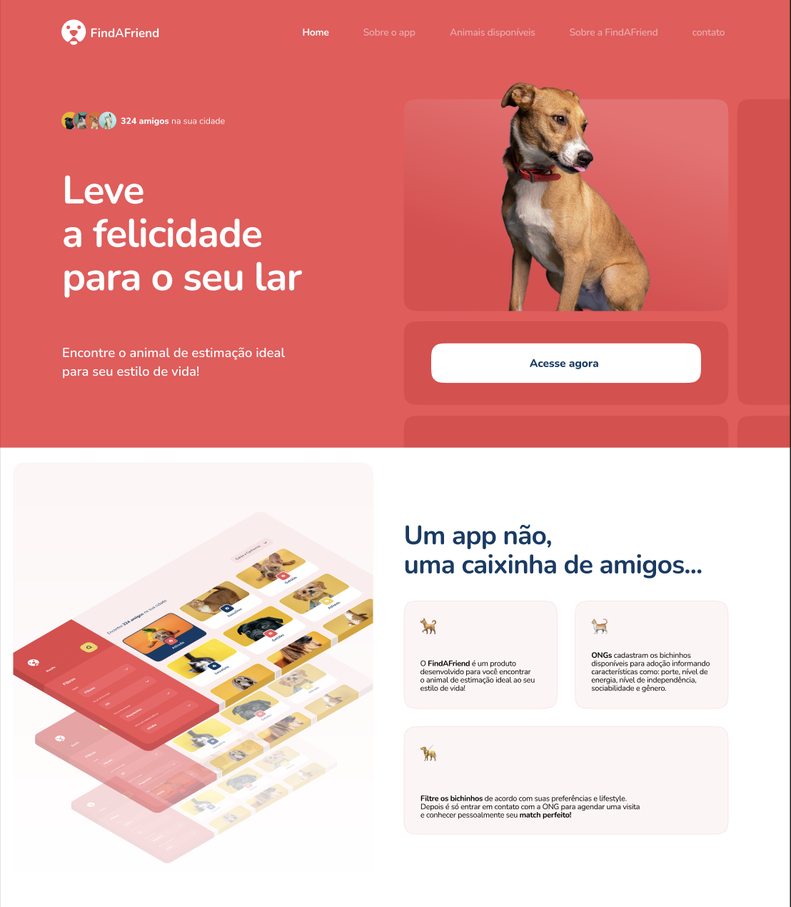
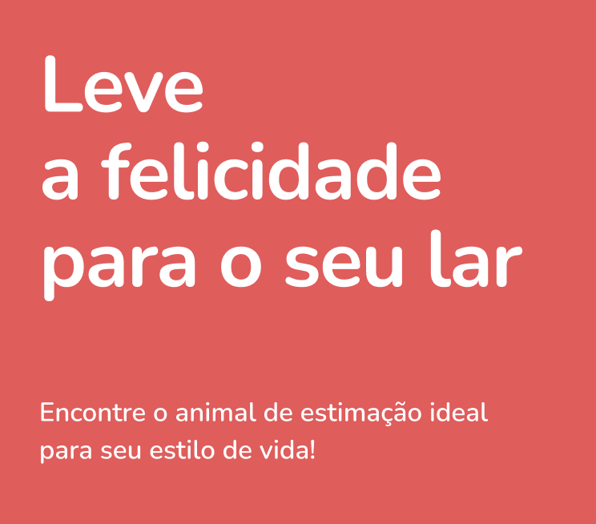
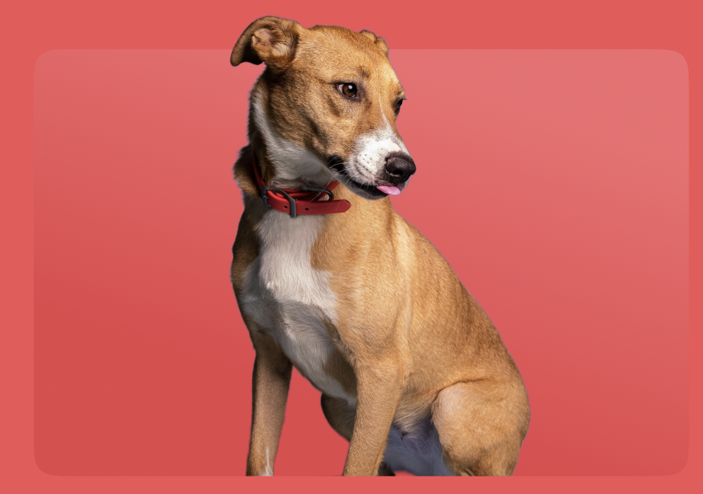
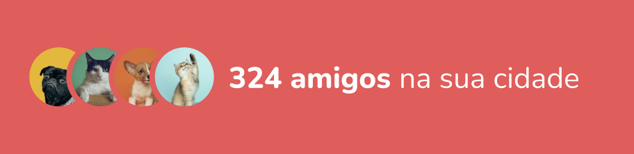
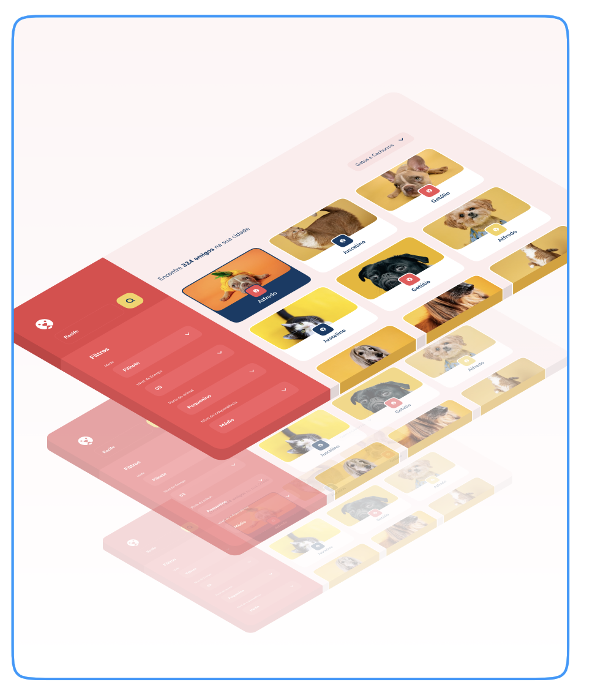
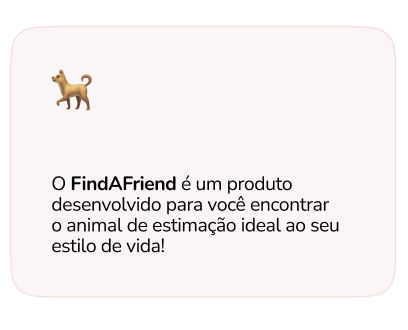

# Mockup

Our team is working on a new app called Find a Friend. We have a mockup of the app that we need to implement. We have already created some components and stories for them. We need you to finish the implementation of the app by creating the remaining components and stories for them.

Each component has a corresponding image that shows how it should look. You can find the images in the `public/mockups` folder.

We will use storybook to visually test components in isolation. Working on components in isolation will make it easier to develop and test components.

To start, open StoryBook, then view the stores for the existing components. Use the StoryBook web interface to view the components and their stories and create new stories for the existing components.

Then, choose additional components on this page to implement and create stories for. Once you have completed a component, add it to the `pages/index.js` or `pages/about.js` file if it is not there already.

Try and get the components as close to the mockup as possible, but if you diverge somewhat, that is OK.

As you develop the components, use StoryBook to test them in isolation. This will make it easier to develop and test the components. Then you can add the components to the pages at `pages/index.js` or `pages/about.js`.

## Find a Friend App Mockup

This is the overall mockup of the Find a Friend app.

 

### Components

#### Header Logo

#### Header Menu

#### Hero Text

#### Hero Image

#### Amigo Counter

#### secondary Image

#### Description Title

#### Amigo Card

#### CTA Button

